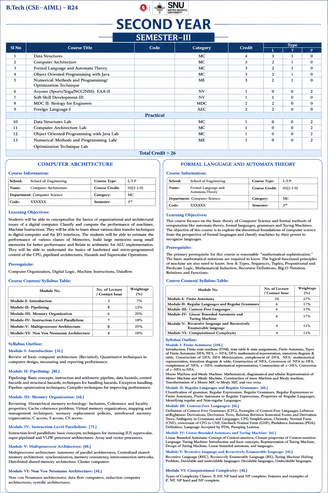

# FLAT-CA-Resources-
📚 A collection of study materials, notes, assignments, programs, and practical resources for Formal Language &amp; Automata Theory (FLAT) and Computer Architecture (CA). This repository is maintained for academic learning, revision, and reference throughout the course.

